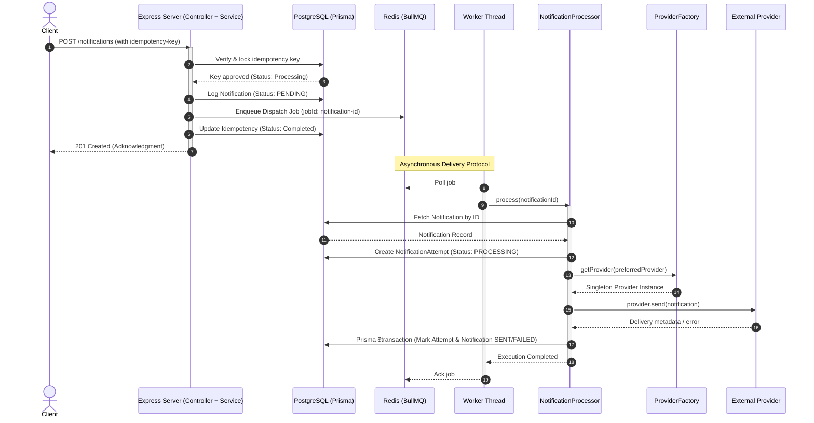

# NotifyHub Backend

NotifyHub is a high-throughput, asynchronous notification dispatch service featuring multi-channel routing, database-backed request idempotency, Zod validation, transactional execution, and queue-based execution.

---

## Production Architecture Overview

Directly sending notifications during a standard HTTP request-response cycle presents two critical production bottlenecks:
1. **Network Latency:** External dispatch gateways (Email/SMS APIs) are slow, causing API delays for clients.
2. **System Outages:** If a downstream gateway goes down, notifications are lost.

NotifyHub resolves this by decoupling **API Request Ingestion** from **Notification Dispatching** using an asynchronous queue and single orchestration layer (`NotificationProcessor`):

### 1. Ingestion Phase (Fast & Safe)
* **Sub-Millisecond Ingestion:** The Express API server acts as a rapid buffer. It validates the payload with Zod, locks the `idempotency-key` in PostgreSQL to prevent duplicate delivery, logs a `PENDING` record, queues a light job pointer in Redis (`notification-{id}`), and immediately returns `201 Created`.
* **Idempotency Protection:** The server hashes the request payload. Duplicate requests are served cached responses instantly or blocked if the original is still processing.

### 2. Dispatch Phase (Reliable & Asynchronous)
* **Worker & Processor Separation:** Separate thin background worker threads pull jobs from Redis (BullMQ) and delegate orchestration directly to `NotificationProcessor`. Slow external systems only block workers, leaving the main web server responsive.
* **Outage Resilience & Atomic Transactions:** The processor creates an immutable `NotificationAttempt` record, resolves the provider via `ProviderFactory`, dispatches the payload, and uses a Prisma transaction (`prisma.$transaction`) to update both `Notification` and `NotificationAttempt` statuses atomically. If a gateway fails, BullMQ automatically schedules retries using exponential backoff. The database tracks state machine transitions: `PENDING` $\rightarrow$ `PROCESSING` $\rightarrow$ `SENT` (or `FAILED` after exhausting retries).



---

## Tech Stack & Project Layout

* **Runtime & Framework:** Node.js (v18+) & Express (v5)
* **Database & ORM:** PostgreSQL & Prisma ORM (with `NotificationStatus` enum)
* **Queue Architecture:** Redis & BullMQ
* **Request Schema Validation:** Zod
* **Logger:** Structured Logger utility (`src/utils/logger.js`)

```text
backend/
├── prisma/               # Schema definitions and migrations
├── src/
│   ├── config/           # Redis configurations
│   ├── constants/        # System-wide constant configurations
│   ├── controllers/      # Route controllers (health, notifications)
│   ├── errors/           # Custom error hierarchy (ProviderError, Permanent, Retryable)
│   ├── lib/              # Prisma client singleton
│   ├── middleware/       # Logger, errors, validation, and idempotency
│   ├── processors/       # Orchestration layer (notification.processor.js)
│   ├── providers/        # Gateway providers (email/mock, resend, provider.factory.js)
│   ├── queues/           # BullMQ queue instantiations
│   ├── routes/           # Express router endpoints
│   ├── services/         # Pure entity services (notification, notificationAttempt, idempotency)
│   ├── utils/            # Shared utilities (structured logger, hashing, AppError)
│   ├── validations/      # Request validation schemas (Zod)
│   └── workers/          # Background worker definitions (notification.worker.js)
```

---

## Core System Protocols

### 1. Request Idempotency
To prevent duplicate processing:
* Requests must include an `idempotency-key` header (UUID recommended).
* Requests with matching keys and payload hashes are served cached responses on success (`200 OK`) or rejected with a conflict error (`409 Conflict`) if currently processing.
* Payload mismatches return a structured `422 Unprocessable Entity` error.

### 2. Notification Status Lifecycle & Queue Resiliency
* Notifications transition through strict Prisma enum states (`NotificationStatus`):
  - `PENDING`: Saved to database and queued in BullMQ.
  - `PROCESSING`: Picked up by worker and attempt initiated.
  - `SENT`: Successfully dispatched by provider.
  - `FAILED`: Delivery failed after execution.
* Each execution attempt creates an immutable `NotificationAttempt` record (`PROCESSING`, `SUCCESS`, `FAILED`) tracking latency, provider message IDs, and error codes.
* Failed jobs undergo **exponential backoff** retries.

---

## API Documentation

### Endpoints Directory

| Method | Endpoint | Headers / Payload | Description | Status Codes |
| :--- | :--- | :--- | :--- | :--- |
| **GET** | `/` | None | Service health check | `200` |
| **POST** | `/notifications` | Header: `idempotency-key` <br> Body: `NotificationPayload` | Queue a notification | `201`, `400`, `409`, `422`, `500` |
| **GET** | `/notifications` | None | List notification history (desc) | `200` |
| **GET** | `/notifications/:id` | None | Fetch notification logs by ID | `200`, `404` |
| **PATCH**| `/notifications/:id/status` | Body: `{ "status": String }` | Manually alter notification status | `200` |
| **DELETE**| `/notifications/:id` | None | Delete notification log | `200` |

### Delivery Request Example
`POST /notifications`

```bash
curl -X POST http://localhost:3000/notifications \
  -H "Content-Type: application/json" \
  -H "idempotency-key: a5f16e4c-1123-42e8-bf99-8cfab2de4e0a" \
  -d '{
    "channel": "email",
    "recipient": "user@example.com",
    "title": "Welcome!",
    "message": "Hello from NotifyHub.",
    "preferredProvider": "mock"
  }'
```

---

## Setup & Execution

### 1. Environment Configurations
Define a `.env` file in the `backend/` directory:
```env
PORT=3000
NODE_ENV=development
DATABASE_URL="postgresql://<user>:<password>@<host>:<port>/<dbname>?sslmode=require"
REDIS_HOST="127.0.0.1"
REDIS_PORT=6379
REDIS_DB=0
DEFAULT_PROVIDER="mock"
```

### 2. Build & Startup Pipeline

```bash
# Install dependencies
npm install

# Start local Redis container
docker-compose up -d

# Push database schema migrations
npx prisma db push

# Generate Prisma Client
npx prisma generate

# Start the API server
npm run dev

# Start the background worker process (separate terminal)
npm run worker
```
