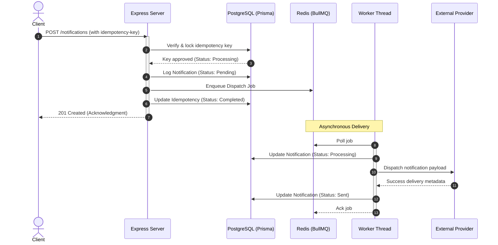

# NotifyHub Backend

NotifyHub is a high-throughput, asynchronous notification dispatch service featuring multi-channel routing, database-backed request idempotency, validation, and queue-based execution.

---

## Production Architecture Overview

Directly sending notifications during a standard HTTP request-response cycle presents two critical production bottlenecks:
1. **Network Latency:** External dispatch gateways (Email/SMS APIs) are slow, causing API delays for clients.
2. **System Outages:** If a downstream gateway goes down, notifications are lost.

NotifyHub resolves this by decoupling **API Request Ingestion** from **Notification Dispatching** using an asynchronous queue:

### 1. Ingestion Phase (Fast & Safe)
*   **Sub-Millisecond Ingestion:** The Express API server acts as a rapid buffer. It validates the payload, locks the `idempotency-key` in PostgreSQL to prevent duplicate delivery, logs a `PENDING` record, queues a light job pointer in Redis, and immediately returns `201 Created`.
*   **Idempotency Protection:** The server hashes the request payload. Duplicate requests are served cached responses instantly or blocked if the original is still processing.

### 2. Dispatch Phase (Reliable & Asynchronous)
*   **Worker Isolation:** Separate background worker threads pull jobs from Redis (BullMQ). Slow external systems only block the workers, leaving the main web server responsive.
*   **Outage Resilience:** If a gateway fails, BullMQ automatically schedules retries using exponential backoff. The database tracks the state machine transition: `PENDING` $\rightarrow$ `PROCESSING` $\rightarrow$ `SENT` (or `FAILED` after exhausting retries).



---

## Tech Stack & Project Layout

*   **Runtime & Framework:** Node.js (v18+) & Express (v5)
*   **Database & ORM:** PostgreSQL & Prisma ORM
*   **Queue Architecture:** Redis & BullMQ
*   **Request Schema Validation:** Zod

```text
backend/
├── prisma/               # Schema definitions and migrations
├── src/
│   ├── config/           # Redis configurations
│   ├── constants/        # System-wide constant configurations
│   ├── controllers/      # Route controllers (health, notifications)
│   ├── middleware/       # Logger, errors, validation, and idempotency
│   ├── providers/        # Extensible notification dispatch gateways
│   ├── queues/           # BullMQ queue instantiations
│   ├── routes/           # Express router endpoints
│   ├── services/         # Core business logic and database hooks
│   ├── utils/            # Shared utilities (hashing, error wrappers)
│   ├── validations/      # Request validation schemas (Zod)
│   └── workers/          # Background worker definitions
```

---

## Core System Protocols

### 1. Request Idempotency
To prevent duplicate processing:
*   Requests must include an `idempotency-key` header (UUID recommended).
*   Requests with matching keys and payload hashes are served cached responses on success (`200 OK`) or rejected with a conflict error (`409 Conflict`) if currently processing.

### 2. Queue-based Resiliency
*   Failed jobs undergo **exponential backoff** (5 attempts, starting with a 5-second delay).
*   Job states transition to database records: `PENDING` -> `PROCESSING` -> `SENT` (or `FAILED` on exhaustive retries).

---

## API Documentation

### Endpoints Directory

| Method | Endpoint | Headers / Payload | Description | Status Codes |
| :--- | :--- | :--- | :--- | :--- |
| **GET** | `/` | None | Service health check | `200` |
| **POST** | `/notifications` | Header: `idempotency-key` <br> Body: `NotificationPayload` | Queue a notification | `201`, `400`, `409`, `500` |
| **GET** | `/notifications` | None | List notification history (desc) | `200` |
| **GET** | `/notifications/:id` | None | Fetch notification logs by ID | `200`, `404` |
| **PATCH**| `/notifications/:id/status` | Body: `{ "status": String }` | Manually alter notification status | `200` |
| **DELETE**| `/notifications/:id` | None | Delete notification log | `200` |

### Delivery Request Example
`POST /notifications`

```bash
curl -X POST http://localhost:3000/notifications \
  -H "Content-Type: application/json" \
  -H "idempotency-key: a5f16e4c-1123-42e8-bf99-8cfab2de4e0a" \
  -d '{
    "channel": "email",
    "recipient": "user@example.com",
    "title": "Welcome!",
    "message": "Hello from NotifyHub."
  }'
```

---

## Setup & Execution

### 1. Environment Configurations
Define a `.env` file in the `backend/` directory:
```env
PORT=3000
NODE_ENV=development
DATABASE_URL="postgresql://<user>:<password>@<host>:<port>/<dbname>?sslmode=require"
REDIS_HOST="localhost"
REDIS_PORT=6379
REDIS_DB=0
```

### 2. Build & Startup Pipeline

```bash
# Install dependencies
npm install

# Start local Redis container
docker-compose up -d

# Push database schema migrations
npx prisma db push

# Start the API server
npm run dev

# Start the background worker process (separate terminal)
npm run worker
```
